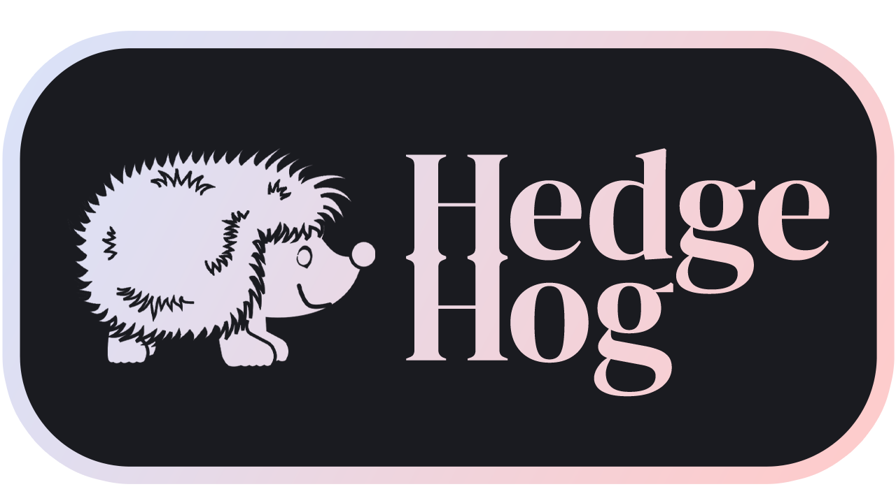

# Important Notice

HedgeHog can make bad financial decisions. I advise all users to keep a track of the investments the program chooses and to research the stocks independently, being ready to intervene if the program makes a mistake. By using HedgeHog, the user agrees to assume all responsibility in case of financial loss or damages resulting directly or indirectly from the program's use.

# Overview


### TABLE OF CONTENTS
- [What is HedgeHog](#what-is-hedgehog)
- [How does it do all of that](#how-does-it-do-all-of-that)
- [Current dev. state](#current-developement-state)
- [Version roadmap](#version-roadmap)
- [How to install and use](#how-to-install-and-use)
- [Who is behind HedgeHog](#who-is-behind-hedgehog)

# What is HedgeHog?
HedgeHog is an open-source, mid-to-long-term-focused stock portfolio manager. HedgeHog's investment model is based on fundamental analysis and market sentiment. For each stock, HedgeHog analyses the company's financial filings and calculates numerous ratios:

- Debt-to-Equity Ratio
- Debt-to-Capital Ratio
- Debt-to-EBITDA Ratio
- Assets-to-Equity Ratio
- Quick Ratio
- Current Ratio
- Ten-Year Operating Expenses Growth
- Ten-Year Liabilities Growth
- Ten-Year Assets Growth
- Ten-Year Share Count Growth

It also conducts some market research on the company:

- Overall public sentiment toward the company
- Overall public sentiment toward the company's leadership
- Overall public sentiment toward the market sector
- Company's efforts in ESG, sustainability and responsible management

It attributes a score to each of the above ratios and parameters based on a standardized normal distribution curve (meaning that the value attributed to the mean is 1.0.)

Based on the above-listed factors, HedgeHog makes one of three decisions:
- It may decide to recommend buying a company if its average score across all parameters is in the 50th percentile or above. This would signify that the company exhibits strong finances and is well-liked by the market. 
- It may decide to put a company on a watchlist if it places between the 25th and 50th percentile. This would mean that the company isn't in the greatest shape but has potential to grow in the near future
- It may decide against buying a company if it places below the 25th percentile. This usually happens if the company exhibits bad finances or the market is hostile against the company.

HedgeHog's portfolio picks are weighted; companies will get a cut of your total budget that is proportional to their score. The goal is to optimize the portfolio division to give more weight to the companies with the strongest finances.

In the current v0.0.1 Beta HedgeHog analyzes a very small set of companies defined in the list `test_set` in `main.py`. In v0 and v1, HedgeHog will be analysing all companies in the S&P 500, and starting from v2, it will analyse the entire US stock market. Non-US markets may come in the future although they are not guaranteed. 

The main challenge with analyzing the entire stock market is identifying shady companies that display good finances on the surface but do not have good foundations in reality. Analyzing non-US stock markets also brings along problems with comparison and currency conversion that may trick the program into making an inaccurate evaluation of the company's finances. 

# How does it do all of that?
HedgeHog is written entirely in Python and mainly uses two APIs to do its job:

- AlphaVantage API: Allows HedgeHog to access financial information about the company
- Google Gemeni API: Allows HedgeHog to analyse the market and the company using up-to-date online information 

# Current developement state
HedgeHog is currently in beta testing. The current release is 0.0.1 BETA, released on Feb. 18 2025. I am currently working on back-testing on historical data and optimizing the algorithm as well as finding more financial parameters to take into account

The currently predicted date for the first v0 stable release is April 2025, with v1 predicted to come out around July or August 2025.

# Version roadmap

### V0

HedgeHog v0 will be the first stable release of HedgeHog. At this stage it will be a simple stock picker that won't make any trades on the market by itself and it will only give recommendations on what to buy. It will not take into account the user's current portfolio.

Its stock list will be limited to the S&P 500. It is going to include a textual UI in the terminal.

### V1
HedgeHog V1 will be the first major update. The main new feature will be semi-active trading, meaning that while it will not be able to trade directly on the stock market itself, whenever it is run, it will ananlyse its portfolio and make changes if need be. HedgeHog V1 will be an actual trading algorithm instead of a stock picker. V1 may also bring along improvements to its analysis algorithms based on the results obtained in V0.

Its stock list will be limited to the S&P 500. It is going to include a textual UI in the terminal.

### V2
HedgeHog V2 will bring along fully-active trading, meaning that it will constantly monitor and change its portfolio as needed. However, it will still not be making active trades in the market on its own. V2 may also bring along improvements to its analysis algorithms based on the results obtained in V1.

Its stock list will be expanded to the entire US Stock Market. It is going to include a textual UI in the terminal.

### V3
HedgeHog V3 will be the first fully-autonomous version of HedgeHog. The fully active trading algorithm of V2 will now be used to make direct trades on the market when linked to a stock exchange account.

Its stock list will be expanded to the entire US Stock Market. It is going to include a textual UI in the terminal.

### V4 and Later

Coming soon!

# How to install and use

Before you install HedgeHog, I would like to remind you that HedgeHog can make bad financial decisions. I advise all users to keep a track of the investments the program chooses and to research the stocks independently, being ready to intervene if the program makes a mistake. By using HedgeHog, the user agrees to assume all responsibility in case of financial loss or damages resulting directly or indirectly from the program's use.

To install the current version of HedgeHog, you need to have Python installed. If you do not, visit [the Python.org website](https://www.python.org) to realize how to install it. With Python installed, open a Linux/MacOS Terminal or Windows Command Line and paste the command below:

```
git clone https://github.com/RandomProgrammerGuy/HedgeHog DESTINATION_PATH
```

Then, use the following command to navigate to the destination path:

```
cd DESTINATION_PATH
```

Alternatively, if you are not comfortable with using a terminal, use the OS itself to navigate to the destination path, right click and open a Terminal/Command Line window in the current directory.

Once you get to the folder, execute the following command in the terminal:

```
python3 main.py
```

If you get no errors during execution, the picks will be written in a file called `portfolio.txt`.

# Who is behind HedgeHog?
HedgeHog is developed and maintained by Parsa Farjam, a CS-Math Double Degree student at Paris-Saclay University. 